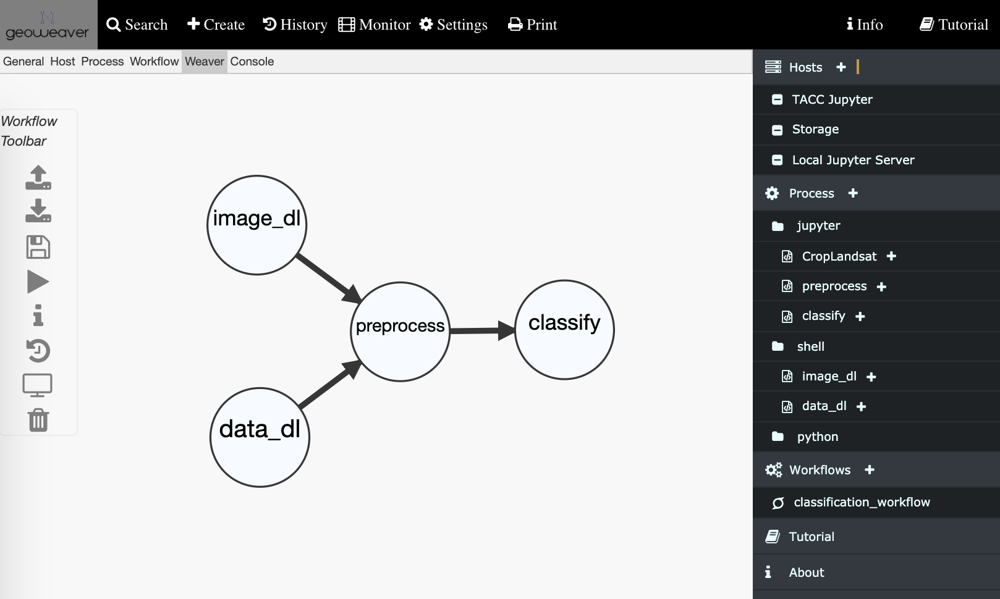

<!doctype html>
<html>
	<head>
		<meta charset="utf-8">
		<meta name="viewport" content="width=device-width, initial-scale=1.0, maximum-scale=1.0, user-scalable=no">

    <title>Gateways 2020 Demo: Geoweaver</title>
    <meta name="author" content="Andrew Magill">

    <link rel="stylesheet" href="lib/tabzilla/css/tabzilla.css"/>
    <link rel="stylesheet" href="lib/reveal/css/reveal.css"/>
    <link rel="stylesheet" href="lib/reveal/css/theme/mozilla-devrel-light.css"/>

		<!-- Theme used for syntax highlighting of code -->
    <link rel="stylesheet" href="lib/reveal/lib/css/solarized-light.css" />

    

		<!-- Printing and PDF exports -->
		
	</head>
  <body>

    <!-- 2. Create hidden header/footer 
 -->
    

        

            
Gateways 2020: Geoweaver

            

            

        

    

		

			

        <section>
          <header>
            <h1>Geoweaver</h1>
            
Manage process workflows and provenance across distributed resources

          </header>
        </section>

        <section>
          <ol>
            <li>What is Geoweaver?</li>
            <li>How does it work?</li>
            <li>What makes Geoweaver unqiue?</li>
            <li>Future work</li>
            <li>Acknowledgments</li>
            <li>Questions</li>
          </ol>
        </section>

        <section>
          <section>
            <h2>What is Geoweaver?</h2>
          </section>

          <section>
            
            

              <a href="https://github.com/delapuente/pangolink" target="_blank">Geoweaver</a>
            is a web base plaform that enables you to manage your deep learning workflows and provenance across distributed resources.</a>
            

          </section>

        </section>

        <section>
          <section>
            <h2>How does it work?</h2>
          </section>

          <section>
            <video style="max-height: 550px;" data-autoplay src="video/create_ssh_host.mp4"></video>
            

              In Geoweaver, hosts are the resources where we run our processes. Here we are registering a machine that we connect to through SSH.
            

          </section>

          <section>
            <video style="max-height: 550px;" data-autoplay src="video/create_jupyter_host_2.mp4"></video>
            

              We can also add Jupyter Servers as host resources, allowing us to interact with and edit our workflow processes.
            

          </section>

          <section>
            <video style="max-height: 550px;" data-autoplay src="video/create_bash_process_4.mp4"></video>
            

            We can add a variety of different types of processes, here we are adding a bash script that will download imagery prior to processing.
            

          </section>

          <section>
            <video style="max-height: 550px;" data-autoplay src="video/create_jupyter_process.mp4"></video>
            

            And we can upload or import Jupyter notebooks.
            

            
<small>Jupyter Notebook source: <a href="https://www.earthdatascience.org/courses/use-data-open-source-python/multispectral-remote-sensing/landsat-in-Python/replace-raster-cell-values-in-remote-sensing-images-in-python/">Intermediate Earth Data Science Textbook</a>, an online course provided by Earth Lab CU Boulder at <a hred="https://www.earthdatascience.org/">earthdatascience.org</a></small>

          </section>

          <section>
            <video style="max-height: 550px;" data-autoplay src="video/process_results_and_file_listing.mp4"></video>
            

            Geoweaver stores a detailed history of every process we have run, we can view the logs, and examine outputs on the server.
            

          </section>

          <section>
            <video style="max-height: 550px;" data-autoplay src="video/create_workflow.mp4"></video>
            

            Processes can be linked together to form workflows, so that we can run our processes in parallel or sequentially across separate resources, and manage it all in one place.
            

          </section>

        </section>

        <section>
          <section>
            <h2>What makes Geoweaver unique?</h2>
          </section>

          <section>
            <video style="max-height: 550px;" data-autoplay src="video/versioned_jupyter_notebook.mp4"></video>
            

            Geoweaver intercepts websocket traffic between you and your Jupyter Server, saving versions of your notebook as you edit, allowing you to return to previous states.
            

          </section>
        </section>

        <section>
          <section>
            <h2>Future work</h2>
          </section>

          <section>
            <iframe width="850" height="550" src="https://earthengine.google.com/" frameborder="0" allowfullscreen></iframe>
            

            We are developing support for Google Earth Engine as a Geoweaver host resource.
            

          </section>
        </section>

        <section>
          <h2>Acknowledgements</h2>
          <ul>
            <li>The following organizations have provided funding and support for the development of Geoweaver: 
              

                <small>
                  <a href="https://www.esipfed.org/">ESIPFed</a>
                  
                  <a href="https://sciencegateways.org/">SGCI</a>
                  
                  <a href="https://earthdata.nasa.gov/">NASA</a>
                  
                </small>
              
</li>
            <li>The following individuals have contributed to the project:
              <small>
              
Ziheng Sun, Center for Spatial Information Science and Systems, George Mason University

              
Liping Di,  Center for Spatial Information Science and Systems, George Mason University

              
Annie Burgess, Earth Science Information Partners (ESIP)

              
Jason A. Tullis, Department of Geosciences and Center for Advanced Spatial Technologies, University of Arkansas

              
Andrew Magill, Texas Advanced Computing Center, The University of Texas at Austin

              </small>
            </li>
          </ul>
        </section>

        <section>
          
Contact

          
<a href="mailto:zsum@gmu.edu">Ziheng Sun: zsun@gmu.edu</a>

          
<a href="mailto:amagill@tacc.utexas.edu">Andrew Magill: amagill@tacc.utexas.edu</a>

          
<a href="https://esipfed.github.io/Geoweaver/">https://esipfed.github.io/Geoweaver/</a>

        </section>

        <section data-markdown>
          ## Questions?
        </section>
      

		

    
    

    

    

    
	</body>
</html>
